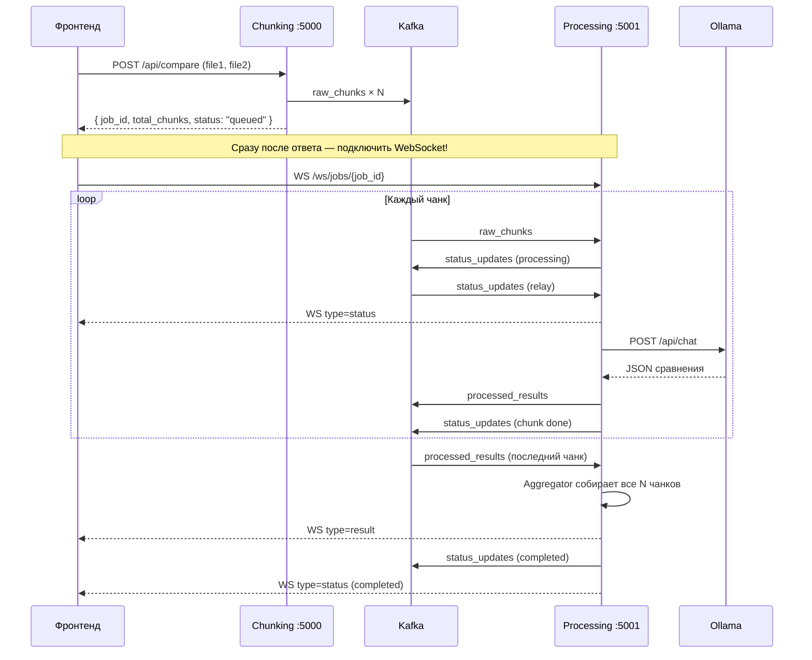

# Поток сообщений и взаимодействие сервисов

Документ описывает, как данные проходят через систему сравнения документов: от загрузки файлов на фронтенде до отображения финального результата.

---

## Участники системы

| Сервис | Порт | Роль |
|--------|------|------|
| **Фронтенд** | `3000` (пример) | Загрузка файлов, WebSocket, отображение прогресса и результата |
| **Chunking & Producer** | `5000` | Приём PDF/DOCX, разбиение на чанки, публикация в Kafka |
| **Processing Service** | `5001` | Ollama, агрегация, WebSocket для фронтенда |
| **Kafka** | `9092` | Очередь сообщений между сервисами |
| **Ollama** | `11434` | Локальная LLM (модель `gemma4`) |

Фронтенд общается с **двумя** бэкендами:
- `http://localhost:5000` — только загрузка (`POST /api/compare`)
- `http://localhost:5001` — WebSocket, статус, результат

---

## Общая схема



---

## Этап 1. Загрузка файлов (Фронтенд → Chunking)

### Запрос

```
POST http://localhost:5000/api/compare
Content-Type: multipart/form-data

file1: <файл .pdf или .docx>
file2: <файл .pdf или .docx>
```

### Ответ

```json
{
  "job_id": "cba6e23b-a3fd-45e1-a0bf-ee09a1e91aec",
  "status": "queued",
  "total_chunks": 40,
  "kafka_topic": "raw_chunks",
  "file1": { "filename": "doc1.docx", "format": "docx", "chunks": 20 },
  "file2": { "filename": "doc2.docx", "format": "docx", "chunks": 20 }
}
```

**Что делает Chunking:**
1. Генерирует `job_id` (UUID)
2. Конвертирует DOCX → текст, PDF → PNG-страницы
3. Разбивает на чанки (~1500 символов)
4. Публикует **N сообщений** в Kafka topic `raw_chunks`
5. Возвращает `job_id` и `total_chunks` — **больше ничего не ждёт**

Chunking **не** отправляет данные на фронтенд после этого. Весь live-прогресс идёт через Processing Service.

---

## Этап 2. Kafka topic `raw_chunks`

Каждое сообщение — один парный чанк двух документов:

```json
{
  "job_id": "cba6e23b-a3fd-45e1-a0bf-ee09a1e91aec",
  "document_id": "cba6e23b-a3fd-45e1-a0bf-ee09a1e91aec",
  "chunk_index": 3,
  "total_chunks": 40,
  "file1": {
    "filename": "doc1.docx",
    "format": "docx",
    "content_type": "text",
    "content": "текст фрагмента..."
  },
  "file2": {
    "filename": "doc2.docx",
    "format": "docx",
    "content_type": "text",
    "content": "текст фрагмента..."
  }
}
```

**Требования к Chunking:**
- `job_id` — одинаковый во всех N сообщениях
- `chunk_index` — от `1` до `total_chunks` без пропусков
- `total_chunks` — одно число во всех сообщениях
- Kafka **key** = `job_id`

---

## Этап 3. Processing Service — обработка чанка (Consumer → Ollama)

Processing Service подписан на `raw_chunks` и для **каждого** сообщения:

### 3.1 Публикует статус «начали чанк»

→ Kafka topic **`status_updates`**:
```json
{
  "job_id": "cba6e23b-a3fd-45e1-a0bf-ee09a1e91aec",
  "document_id": "cba6e23b-a3fd-45e1-a0bf-ee09a1e91aec",
  "status": "processing",
  "processed_chunks": 2,
  "total_chunks": 40,
  "message": "Анализ chunk 3/40...",
  "updated_at": "2026-07-01T15:49:00+00:00"
}
```

### 3.2 Вызывает Ollama

```
POST http://localhost:11434/api/chat
{ "model": "gemma4", "messages": [...], "format": "json" }
```

### 3.3 Публикует результат чанка

→ Kafka topic **`processed_results`**:
```json
{
  "job_id": "cba6e23b-a3fd-45e1-a0bf-ee09a1e91aec",
  "document_id": "cba6e23b-a3fd-45e1-a0bf-ee09a1e91aec",
  "chunk_index": 3,
  "total_chunks": 40,
  "ollama": { "message": { "content": "{...}" } },
  "comparison_fragment": {
    "identical": false,
    "differences": [
      { "line_number": 1, "file1_line": "...", "file2_line": "..." }
    ]
  },
  "processed_at": "2026-07-01T15:49:32+00:00"
}
```

### 3.4 Публикует статус «чанк готов»

→ Kafka topic **`status_updates`**:
```json
{
  "status": "processing",
  "processed_chunks": 3,
  "total_chunks": 40,
  "message": "Обработка 3/40 завершена для chunk 3"
}
```

Обработка идёт **параллельно** (до 3 чанков одновременно), поэтому `chunk_index` в статусах может «прыгать» (3, 6, 2...) — это нормально. Смотрите на `processed_chunks / total_chunks`.

---

## Этап 4. Доставка на фронтенд (Aggregator + WebSocket)

Внутри Processing Service работают **два relay-consumer'а**:

| Consumer | Читает из | Действие |
|----------|-----------|----------|
| **StatusRelay** | `status_updates` | Пересылает на WebSocket как `type: "status"` |
| **Aggregator** | `processed_results` | Собирает все N чанков → финальный JSON |

### 4.1 Прогресс (во время обработки)

StatusRelay получает каждое сообщение из `status_updates` и отправляет на WebSocket:

```json
{
  "type": "status",
  "job_id": "cba6e23b-a3fd-45e1-a0bf-ee09a1e91aec",
  "data": {
    "job_id": "cba6e23b-a3fd-45e1-a0bf-ee09a1e91aec",
    "document_id": "cba6e23b-a3fd-45e1-a0bf-ee09a1e91aec",
    "status": "processing",
    "processed_chunks": 3,
    "total_chunks": 40,
    "message": "Анализ chunk 6/40...",
    "updated_at": "2026-07-01T15:49:32+00:00"
  }
}
```

**Фронтенд должен:**
- Подключиться к WebSocket **сразу** после получения `job_id`
- Обновлять прогресс-бар: `processed_chunks / total_chunks * 100`
- Показывать `data.message` как текст статуса

### 4.2 Финальный результат (после всех чанков)

Когда Aggregator получил **все** `total_chunks` сообщений из `processed_results`:

1. Объединяет `comparison_fragment` всех чанков в один JSON
2. Отправляет на WebSocket:

```json
{
  "type": "result",
  "job_id": "cba6e23b-a3fd-45e1-a0bf-ee09a1e91aec",
  "data": {
    "comparison": {
      "identical": false,
      "differences": [
        { "line_number": 1, "file1_line": "...", "file2_line": "..." },
        { "line_number": 5, "file1_line": "...", "file2_line": "..." }
      ]
    }
  }
}
```

3. Публикует финальный статус в Kafka → снова на WebSocket:

```json
{
  "type": "status",
  "data": {
    "status": "completed",
    "processed_chunks": 40,
    "total_chunks": 40,
    "message": "Document ...: готово! Результат готов."
  }
}
```

---

## Этап 5. WebSocket — как подключаться

### URL

```
ws://localhost:5001/ws/jobs/{job_id}
```

`job_id` — из ответа `POST /api/compare` (Chunking, порт 5000).

### Когда подключаться

**Сразу** после получения `job_id`, **до** окончания обработки.

Если подключиться позже — пропущенные статусы **не переотправляются**, кроме финального результата (если он уже готов, сервер отправит `type: result` при подключении).

### Пример на JavaScript

```javascript
const CHUNKING_API = "http://localhost:5000";
const PROCESSING_WS = "ws://localhost:5001";

async function compareFiles(file1, file2) {
  const form = new FormData();
  form.append("file1", file1);
  form.append("file2", file2);

  const res = await fetch(`${CHUNKING_API}/api/compare`, { method: "POST", body: form });
  const { job_id, total_chunks } = await res.json();

  return new Promise((resolve, reject) => {
    const ws = new WebSocket(`${PROCESSING_WS}/ws/jobs/${job_id}`);

    ws.onmessage = (event) => {
      const msg = JSON.parse(event.data);

      if (msg.type === "status") {
        const { processed_chunks, total_chunks, message, status } = msg.data;
        updateProgress(processed_chunks, total_chunks);  // прогресс-бар
        updateStatusText(message);                        // текст статуса
        if (status === "failed") reject(new Error(message));
      }

      if (msg.type === "result") {
        showComparison(msg.data.comparison);              // показать результат
        ws.close();
        resolve(msg.data.comparison);
      }

      if (msg.type === "error") {
        reject(new Error(msg.data.message));
      }
    };

    ws.onerror = () => reject(new Error("WebSocket error"));
  });
}
```

### REST fallback (если WebSocket не сработал)

```
GET http://localhost:5001/api/jobs/{job_id}/result
```

- `200` — результат готов (тот же формат, что `type: result`)
- `404` — ещё обрабатывается, повторить через 2–3 сек

```
GET http://localhost:5001/api/jobs/{job_id}
```

— текущий статус без WebSocket.

---

## Почему на фронте не видно прогресс и результат

По логам Processing Service типичная причина:

```
[WS] no clients for job=... — event type=status not delivered (frontend not connected?)
```

Это значит:
- Kafka работает
- Ollama обрабатывает чанки
- Статусы и результаты **генерируются**
- Но **фронтенд не подключён** к WebSocket на порту **5001**

### Чеклист для фронтенда

- [ ] WebSocket идёт на `ws://localhost:5001`, **не** на `5000`
- [ ] Подключение **сразу** после `POST /api/compare`
- [ ] В URL тот же `job_id`, что вернул Chunking
- [ ] Обработчик `onmessage` разбирает `msg.type === "status"` и `msg.type === "result"`
- [ ] Прогресс берётся из `msg.data.processed_chunks / msg.data.total_chunks`
- [ ] Если фронт на другом порту (`3000`) — настроен прокси для WebSocket или CORS

### Чеклист для бэкенда

- [ ] Chunking публикует в `raw_chunks` с правильным `job_id`
- [ ] Processing Service запущен на `5001`
- [ ] Ollama отвечает 200 на `/api/chat` (модель `gemma4` установлена)
- [ ] В логах есть `[AGGREGATOR] complete job=...` — все чанки собраны
- [ ] В логах есть `[WS] send ... type=result` — результат отправлен (и клиент подключён)

---

## Таблица Kafka-топиков

| Топик | Кто пишет | Кто читает | Назначение |
|-------|-----------|------------|------------|
| `raw_chunks` | Chunking | Processing (Consumer) | Сырые чанки документов |
| `processed_results` | Processing | Processing (Aggregator) | Результат Ollama по каждому чанку |
| `status_updates` | Processing | Processing (StatusRelay) → WS | Прогресс и финальный статус |
| `raw_chunks_dlt` | Processing | — (ручной разбор) | Чанки с ошибками |

Фронтенд **не читает Kafka напрямую**. Он получает данные только через:
1. **WebSocket** `ws://localhost:5001/ws/jobs/{job_id}` — основной способ
2. **REST** `GET /api/jobs/{job_id}/result` — запасной способ

---

## Жизненный цикл статусов

```
queued          ← Chunking вернул ответ (опционально из Kafka)
    ↓
processing      ← идёт обработка чанков Ollama
    ↓             (processed_chunks растёт: 1/40, 2/40, ... 40/40)
processing      ← "Все фрагменты обработаны, сборка результата..."
    ↓
completed       ← Aggregator собрал финальный JSON + WS type=result
```

При ошибке Ollama:
```
failed          ← чанк ушёл в DLT, WS type=status с status=failed
```

---

## Диагностика по логам Processing Service

| Лог | Значение |
|-----|----------|
| `[KAFKA IN] topic=raw_chunks` | Чанк получен от Chunking |
| `[OLLAMA] response status=200` | Ollama ответила успешно |
| `[KAFKA OUT] topic=status_updates` | Статус опубликован |
| `[STATUS RELAY] progress=3/40` | Relay готов переслать на WS |
| `[WS] no clients for job=...` | **Фронт не подключён — UI ничего не увидит** |
| `[WS] send type=status clients=1` | Статус доставлен на фронт |
| `[AGGREGATOR] collected ... 40/40` | Все чанки собраны |
| `[AGGREGATOR] complete` | Финальный JSON готов |
| `[WS] send type=result clients=1` | Результат доставлен на фронт |

---

## Итог: что должен делать фронтенд

```
1. POST /api/compare  →  localhost:5000     →  получить job_id
2. WS connect         →  localhost:5001     →  /ws/jobs/{job_id}
3. onmessage status   →  обновить прогресс  →  processed_chunks / total_chunks
4. onmessage result   →  показать таблицу   →  data.comparison.differences
5. (fallback) GET     →  localhost:5001     →  /api/jobs/{job_id}/result
```

Без шага 2 прогресс и результат **не появятся на UI**, даже если бэкенд отработал корректно.
